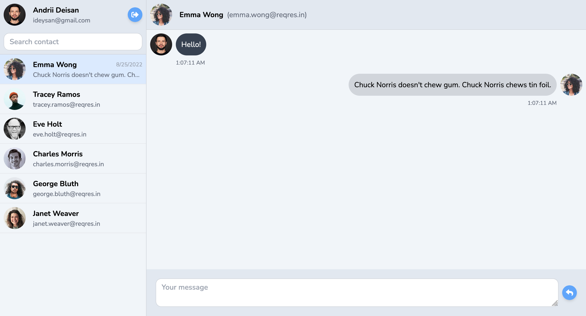
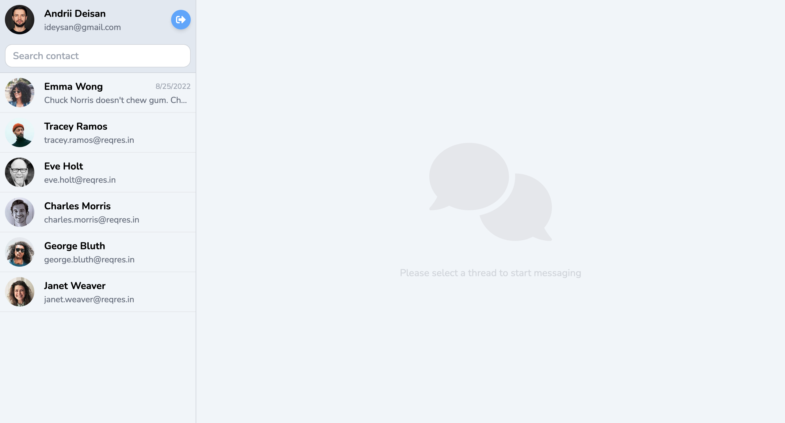
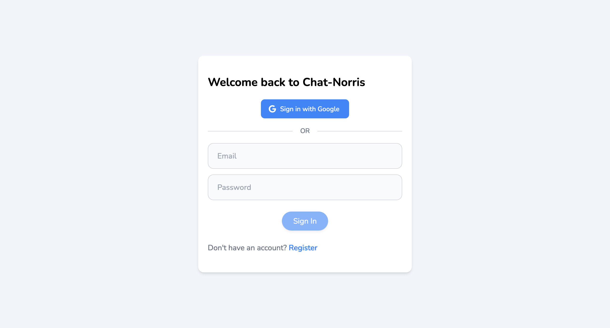

# Chatbot with Chuck Norris jokes

View the application at [Deployed Project Link](https://chat-norris.vercel.app/)

## Tech stack

## Project overview

The conversation page contains the avatar of the interlocutor, the text, and the time of sending of the message.\
After selecting an interlocutor, the user has the opportunity to write a message to the chat, and after sending it, he will receive an automatic response in 10-15 seconds.\
[The Chuck Norris API](https://api.chucknorris.io) is used for automatic message generation, namely the random joke generation method.

***

The sidebar displays a list of available messaging contacts.\
A convenient search by contacts is also implemented.\
The contact displays a preview and the date of the last message.

***

On the login page, existing users can log in using their email address and password.\
If you don't have an account, you can register.\
For a quick login, a way to connect through a Google account has been implemented.

## Available scripts

### `yarn dev`

Runs the app in the development mode.\
Open [http://localhost:5173](http://localhost:5173) to view it in your browser.

### `yarn build`

Builds the app for production to the `dist` folder.
